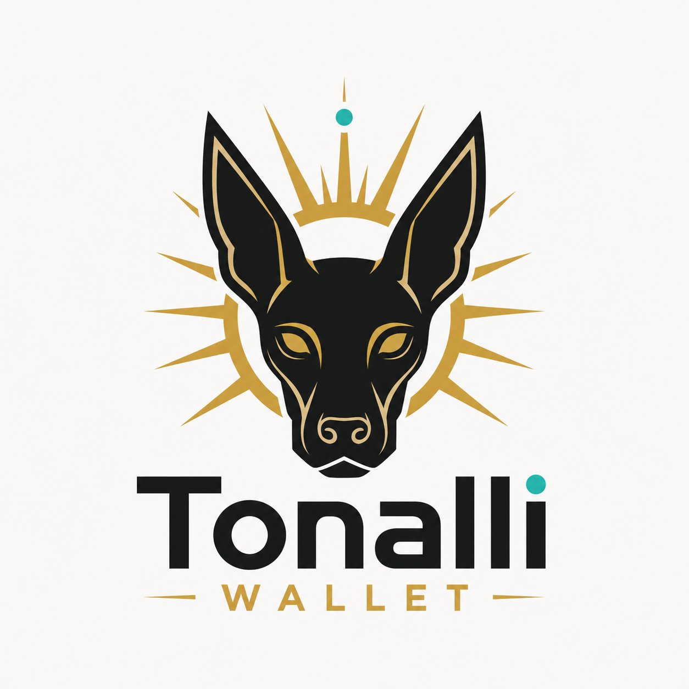

# Tonalli Wallet

Verifica. Autocustodia. Libérate.

Tonalli Wallet es la marca pública oficial de este repositorio. El repositorio conserva el nombre técnico `RMZWallet` por continuidad de historial, integraciones y compatibilidad interna.

Tonalli Wallet es una wallet soberana, open source y no custodial para eCash. Tus llaves permanecen en tu dispositivo; Tonalli Wallet no custodia tus fondos y tú autorizas cada operación.

## Funciones

- eCash (XEC) para saldo, recepción, envío, comisiones y memos on-chain con OP_RETURN.
- eToken Xolos RMZ integrado para consulta y envío.
- NFTs de linaje y coleccionables cuando la configuración NFT del entorno está disponible.
- Alias .xec mediante el flujo de registro soportado por la app.
- WalletConnect v2 para dApps eCash compatibles.
- Tonalli Connect para solicitudes externas de firma.
- Multifirma eCash P2SH experimental.
- DEX / Agora en las rutas disponibles de la app; su operación puede depender de infraestructura externa, liquidez y Offer IDs válidos.
- x402 para los flujos habilitados por configuración.

Tonalli Wallet forma parte de xolosArmy Network.

## Variables de entorno

Configura estas variables en Vercel o tu entorno local:

- `VITE_PINATA_JWT` (recomendado) o `VITE_PINATA_API_KEY` + `VITE_PINATA_SECRET`
- `VITE_PINATA_GATEWAY` (opcional) para render de imágenes IPFS
- `VITE_XOLOSARMY_NFT_PARENT_TOKEN_ID` (token padre NFT1 Group)
- `VITE_NFT_MINT_FEE_RECEIVER_ADDRESS` (tesorería para el fee de minteo)
- `VITE_WALLETCONNECT_PROJECT_ID` (principal, requerido para WalletConnect v2)
- `VITE_WC_PROJECT_ID` (legacy compatible; fallback si falta la principal)
- `VITE_WC_ALLOWED_DOMAINS` (opcional, lista CSV para warning anti-phishing en UI; sugerido: `teyolia.cash,www.teyolia.cash`)

## WalletConnect v2 (CAIP-25)

- Namespace soportado: `ecash`
- Chain estándar soportada: `ecash:1`
- Compat legacy: también se acepta `ecash:mainnet` si la dApp lo propone
- Métodos soportados:
  - `ecash_getAddresses`
  - `ecash_signMessage`
  - `ecash_signAndBroadcastTransaction`
  - `ecash_signAndBroadcast`
- Accounts CAIP-10: `<chain>:<address>` (preferido `ecash:1:<address>`)

### Errores JSON-RPC expuestos a la dApp

- Usuario rechaza: `{ code: 4001, message: "Rechazado por el usuario." }`
- Params inválidos (`offerId` o `outputs` requeridos): `{ code: -32602, message: "Params inválidos: offerId o outputs requeridos" }`
- Método no soportado: `{ code: -32601, message: "Método no soportado" }`
- Error interno de firma/transmisión: `{ code: -32000, message: "Error al firmar/transmitir" }`

### Validación manual (dev)

- Flujo intent-only: conectar Flipstarter -> Donar -> debe abrir modal de Tonalli Wallet y firmar sin mostrar `Usa el formato txid:vout.` cuando la request solo trae `outputs`.

### Mining Gateway WalletConnect flow

1. `mining.ecash.mx` genera un URI `wc:`.
2. El usuario pega el URI `wc:` en Tonalli Wallet -> Conectar dApps.
3. El usuario aprueba la sesión de WalletConnect.
4. Mining Gateway envía `ecash_signMessage` con el challenge exacto.
5. Tonalli Wallet muestra una pantalla de aprobación `Firmar mensaje`.
6. Tonalli Wallet firma con `xolosWalletService.signMessage(message)`.
7. Tonalli Wallet devuelve `address`, `publicKey`/`pubkey`, `signature` y `challengeId`.
8. Mining Gateway verifica la firma y emite el token de sesión de minería.

## NFTs

Ver pruebas manuales sugeridas en `docs/nfts.md`.

## Tonalli Connect sign-message

Tonalli Wallet expone la ruta `/connect/sign-message` para que apps externas, como eCash México Mining Gateway, soliciten una firma de challenge sin exponer llaves privadas. El callback vuelve por hash params con `status`, `address`, `pubkey`, `signature` y `challengeId`.

Detalles y ejemplos: `docs/tonalli-connect-sign-message.md`.
